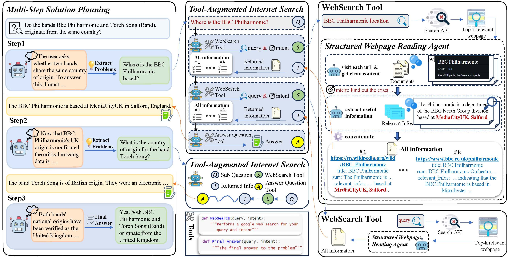
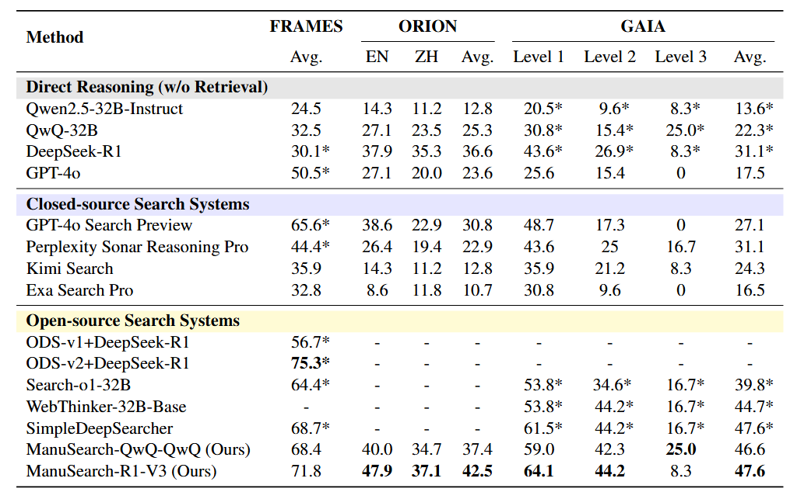

<h1 align="center"> 🌐 ManuSearch: Democratizing Deep Search in Large Language Models with a Transparent and Open Multi-Agent Framework</a></h1>

<div align="center"> 

[](https://arxiv.org/pdf/2505.18105)
[](https://huggingface.co/datasets/RUC-AIBOX/ORION)
[](https://opensource.org/licenses/MIT) 

</div>

## Introduction

<p align="center">
  
</p>

We propose `ManuSearch`, a transparent and modular multi-agent framework designed to democratize deep search for LLMs. ManuSearch decomposes the search and reasoning process into three collaborative agents: (1) a solution planning agent that iteratively formulates sub-queries, (2) an Internet search agent that retrieves relevant documents via real-time web search, and (3) a structured webpage reading agent that extracts key evidence from raw web content. 

To rigorously evaluate deep reasoning abilities, we introduce `ORION`, a challenging benchmark focused on open-web reasoning over long-tail entities, covering both English and Chinese.

Experimental results show that ManuSearch substantially outperforms prior open-source baselines and even surpasses leading closed-source systems.

<p align="center">
  
</p>

The `ORION` dataset is also available now on [HuggingFace](https://huggingface.co/datasets/RUC-AIBOX/ORION) 🤗.


## 🔧 Installation

### Environment Setup

```bash
conda create --name manusearch python=3.9
conda activate manusearch

# Install requirements
cd ManuSearch
pip install -r requirements.txt
```
## 🏃 Quick Start

### Pre-preparation

#### Model Serving
Our system comprises three LLM-based collaborative agents where each agent supports various configurations by integrating different LLMs, enabling diverse combinations tailored to specific tasks. 

Before running manusearch, ensure your planner model, searcher model and reader model are served as **OpenAI-Compatible Server** using vLLM. In our experiments, we use QwQ-32B/deepseek-R1 as the planner model, QwQ-32B/deepseek-V3 as the searcher model and Qwen2.5-32B-Instruct as the reader model, respectively. For detailed instructions on model serving, see [here](https://docs.vllm.ai/en/stable/serving/openai_compatible_server.html). 

We also conducted in-depth discussions on how to select models for each module. For details, please refer to Section 5 of the [paper](https://arxiv.org/pdf/2505.18105).


#### Google search api

We use Serper.dev Google Search API as our search engine api. To use, you should pass your serper API key to the constructor. You can create a free API key at https://serper.dev. We recommend enabling a proxy to prevent access issues with certain websites. We also implemented a cache to store the full text of accessed web pages. Please configure your cache folder path accordingly.


Now you can run different inference modes using the provided scripts. Below are examples of how to execute each mode:

### Problem Solving

1. If you would like to ask a single question, run the following command:
```bash
python run_manusearch.py \
  --google_subscription_key "YOUR_GOOGLE_SUBSCRIPTION_KEY" \
  --google_search_topk 5 \
  --proxy "your proxy"\
  --planner_model_name "QwQ-32B"\
  --planner_api_base "YOUR_PLANNER_MODEL_API_BASE_URL"\
  --planner_api_key "YOUR_PLANNER_MODEL_API_KEY"\
  --searcher_model_name "QwQ-32B"\
  --searcher_api_base "YOUR_SEARCHER_MODEL_API_BASE_URL"\
  --searcher_api_key "YOUR_SEARCHER_MODEL_API_KEY"\
  --reader_model_name "Qwen2.5-32B-Instruct"\
  --reader_api_base "YOUR_READER_MODEL_API_BASE_URL"\
  --reader_api_key "YOUR_READER_MODEL_API_KEY"\
  --cache_dir "/path/to/your/cache"\
  --single_question "What is OpenAI Deep Research?"
```

2. If you would like to run results on benchmarks, run the following command:
```bash
python run_manusearch.py \
  --dataset_name GAIA \
  --split dev \
  --google_subscription_key "YOUR_GOOGLE_SUBSCRIPTION_KEY" \
  --google_search_topk 5 \
  --proxy "your proxy"\
  --planner_model_name "QwQ-32B"\
  --planner_api_base "YOUR_PLANNER_MODEL_API_BASE_URL"\
  --planner_api_key "YOUR_PLANNER_MODEL_API_KEY"\
  --searcher_model_name "QwQ-32B"\
  --searcher_api_base "YOUR_SEARCHER_MODEL_API_BASE_URL"\
  --searcher_api_key "YOUR_SEARCHER_MODEL_API_KEY"\
  --reader_model_name "Qwen2.5-32B-Instruct"\
  --reader_api_base "YOUR_READER_MODEL_API_BASE_URL"\
  --reader_api_key "YOUR_READER_MODEL_API_KEY"\
  --cache_dir "/opt/aps/workdir/hls/WebRAG/cache"
```


**Parameters Explanation:**
- `--dataset_name`: Name of the dataset to use (glaive).
- `--split`: Data split to run (test).
- `--single_question`: The question you want to ask when running in single question mode.
- `--concurrent_limit`: Maximum number of concurrent requests.
- `--cache_dir`: "cache for searched webpages".
- `--proxy`: "port-based proxy(e.g., localhost:8080)"
- `--google_subscription_key`: Your serper.dev Google Search API subscription key.
- `--google_search_topk`: topk returned documents for google search.
- ` --planner_model_name`: "Name of the planner model to use".
-  `--planner_api_base`: "Base URL for the API endpoint".
-  `--planner_api_key`: "api key for the planner model API endpoint".
-  `--searcher_model_name`: "Name of the searcher model to use".
-  `--searcher_api_base`: "Base URL for the API endpoint".
-  `--searcher_api_key`: "api key for the searcher model API endpoint".
-  `--reader_model_name`: "Name of the reader model to use".
-  `--reader_api_base`: "Base URL for the API endpoint".
-  `--reader_api_key`: "api key for the reader model API endpoint".


### Evaluation
If you would like to evaluate results on benchmarks, run the following command:
```bash
python eval_ans_searchagent.py \
  --model_name "MODEL_NAME"\
  --api_base "MODEL_API_BASE_URL"\
  --api_key "YOUR_API_KEY"\
  --file_path "path/to/your/answers"
```

## 📄 Citation

If you find this work helpful, please cite our paper:
```bibtex
@misc{huang2025manusearchdemocratizingdeepsearch,
      title={ManuSearch: Democratizing Deep Search in Large Language Models with a Transparent and Open Multi-Agent Framework}, 
      author={Lisheng Huang and Yichen Liu and Jinhao Jiang and Rongxiang Zhang and Jiahao Yan and Junyi Li and Wayne Xin Zhao},
      year={2025},
      eprint={2505.18105},
      archivePrefix={arXiv},
      primaryClass={cs.CL},
      url={https://arxiv.org/abs/2505.18105}, 
}
```